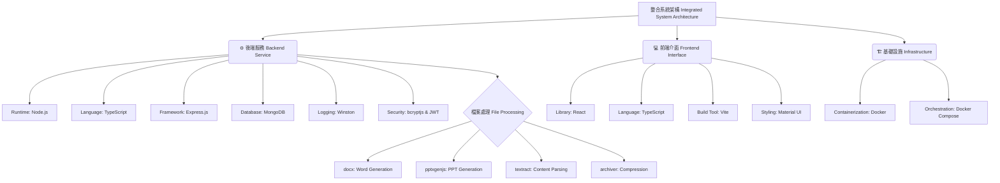

# 自動化敬拜投影與文件生成系統

本專案旨在開發一套自動化系統，用於生成教會敬拜所需之多媒體資源。系統依據使用者選定的詩歌列表，能夠自動產出適用於大字報列印的 Word 文件，以及適用於投影播放的 PowerPoint 簡報。

本系統已演進為一個完整的全端網頁應用程式 (Full-stack Web Application)。後端採用 Node.js 與 TypeScript 建構，並結合 Express.js 框架與 MongoDB 資料庫；前端則基於 React 與 TypeScript 開發，利用 Vite 進行建置。整體架構透過 Docker Compose 實現容器化部署，以確保環境的一致性與可移植性。

## 🚀 系統功能 (System Features)

- **詩歌資料庫管理 (Song Database Management)**
建立結構化的資料庫以儲存詩歌資訊，包含唯一識別碼 (ID) 與名稱，便於資料的持久化與檢索。

- **高效率詩歌檢索 (High-Performance Search)**
支援透過 ID 或關鍵字進行模糊搜尋，快速定位所需詩歌資源。

- **權限導向之資料管理 (Role-Based CRUD Operations)**
提供完整的詩歌新增、編輯與刪除功能。系統實作了基於角色的存取控制 (RBAC)，確保僅有授權之管理員能執行資料異動操作。

- **自動化文件生成 (Automated Artifact Generation)**
核心演算法能解析選定的詩歌內容，自動排版並生成 Microsoft Word (.docx) 與 PowerPoint (.pptx) 格式檔案，大幅降低人工製作成本。

- **安全身份驗證 (Secure Authentication)**
實作使用者註冊與登入機制，採用 JWT (JSON Web Token) 標準進行無狀態 (Stateless) 的身份驗證與授權。

- **容器化部署 (Containerized Deployment)**
利用 Docker 技術封裝應用程式及其依賴環境，透過 Docker Compose 協調多容器運作，簡化部署流程。

## ⚙️ 技術架構 (Technical Architecture)

本系統採用分層架構設計，以下為技術堆疊之樹狀結構圖：




## 📂 專案結構 (Project Structure)

```
Auto_Word_PPT/
├── backend/                 # 後端服務 (Node.js + Express + Python)
│   ├── src/                 # TypeScript 原始碼
│   │   ├── index.ts         # 伺服器入口 (API 路由、MongoDB 連線、權限驗證)
│   │   ├── generator.ts     # 檔案生成邏輯控制器 (呼叫 Python 腳本)
│   │   └── import-db.ts     # 資料庫初始化工具 (匯入 songs_db.json)
│   ├── scripts/             # 外部腳本
│   │   └── generator.py     # 核心生成引擎 (使用 python-docx/pptx 處理檔案)
│   ├── dist/                # [Artifact] 編譯後的 JavaScript 執行檔
│   ├── Dockerfile           # 後端容器建置檔
│   ├── package.json         # Node.js 相依套件設定
│   ├── requirements.txt     # Python 相依套件設定
│   └── tsconfig.json        # TypeScript 編譯設定
├── frontend/                # 前端介面 (React + Vite + Material UI)
│   ├── src/                 # React 原始碼
│   │   ├── components/      # UI 元件庫
│   │   │   ├── FileGenerator.tsx  # 檔案生成頁面 (搜尋、預覽、下載)
│   │   │   ├── Login.tsx          # 管理員登入元件
│   │   │   ├── SongManager.tsx    # 詩歌資料庫管理介面 (CRUD)
│   │   │   └── UserManager.tsx    # 帳號權限管理介面 (Super Admin)
│   │   ├── App.tsx          # 應用程式主路由與佈局
│   │   └── index.tsx        # 前端入口點
│   ├── public/              # 靜態資源 (圖示、Manifest)
│   ├── Dockerfile           # 前端容器建置檔 (多階段構建)
│   ├── nginx.conf           # Nginx 反向代理設定
│   ├── package.json         # 前端相依套件設定
│   └── vite.config.ts       # Vite 建置設定
├── resources/               # 靜態資源與設定檔 (掛載至容器)
│   ├── ppt_library/         # 存放 PPTX 來源檔案
│   ├── songs_db.json        # 初始詩歌資料庫匯入檔
│   └── template.docx        # Word 大字報範本 (若有)
├── output/                  # [Artifact] 生成檔案輸出目錄
├── docker-compose.yml       # 容器編排設定檔
├── .env.example             # 環境變數範本
└── README.md                # 專案說明文件
```

## 🛠️ 系統建置與執行 (Installation and Execution)

**前置需求 (Prerequisites)**

- Git: 用於版本控制與程式碼獲取。

- Docker & Docker Compose: 強烈建議安裝，以確保執行環境與開發環境一致。

### 1. 取得專案程式碼 (Clone Repository)
```
git clone <your-repository-url>
cd Auto_ppt_word
```

### 2. 環境變數配置 (Configuration)

請複製範例設定檔以建立 .env 檔案，並填入您的環境參數：
```
cp .env.example .env
```

**參數說明：**

- `MONGO_URI`: MongoDB 連線字串 (Docker 環境內預設為 mongodb://mongo:27017)。

- `JWT_SECRET`: JWT 簽署密鑰 (警告：在生產環境中務必使用高強度的隨機字串)。

- `VITE_API_URL`: 前端呼叫後端 API 的位址 (預設為 http://localhost:3000)。

### 3. 資料庫初始化 (Database Initialization)

系統包含初始化腳本，可將 `resources/songs_db.json` 匯入資料庫。
若使用 Docker Compose，請參閱後續章節；若手動執行，請使用以下指令：
```
cd backend
npm install
npm run db:import
cd ..
```

### 4. 容器化部署與維運 (Containerized Operations)

本專案採用多階段建置 (Multi-stage builds) 與 Docker Compose 進行管理。以下為常用的維運指令。

**🔹 建置並推送映像檔 (Build and Push Images)**

若需將應用程式部署至遠端伺服器或 GCP VM，請先針對 linux/amd64 平台建置映像檔並推送至 Registry (如 Docker Hub)。請確保您已登入 Docker Hub。
```
# 建置前端映像檔 (指定平台以確保相容性)
docker buildx build --no-cache --platform linux/amd64 -t asher31892774/church-frontend:latest ./frontend

# 建置後端映像檔
docker buildx build --no-cache --platform linux/amd64 -t asher31892774/church-backend:latest ./backend

# 推送映像檔至 Registry
docker push asher31892774/church-frontend:latest
docker push asher31892774/church-backend:latest
```

**🔹 服務部署與更新 (Deployment and Update)**

在部署環境 (如 GCP VM) 中，當映像檔更新或設定變更後，請依序執行以下指令以重啟服務。

**標準更新流程：**
```
docker-compose down
docker-compose up -d --build
```

**強制重建流程 (Force Rebuild)：**
若遇到快取導致程式碼未更新的問題，請使用以下指令強制清除快取並重新建置：
```
sudo docker-compose down && sudo docker-compose build --no-cache && sudo docker-compose up -d
```

### 5. 開發模式執行 (Development Mode)

若不使用 Docker，可分別啟動前後端服務進行開發。

**後端 (Backend)**
```
cd backend
npm install
npm run dev
```

服務將啟動於 `http://localhost:3000`。

**前端 (Frontend)**
```
cd frontend
npm install
npm run dev
```

服務將啟動於 `http://localhost:5173`。

## 🧪 系統操作說明 (Usage Guide)

1. 身份驗證：
開啟瀏覽器前往前端頁面。系統預設會初始化一組超級管理員帳號 (admin / admin)。請登入後立即修改密碼。

2. 帳號管理 (Super Admin)：
僅超級管理員可存取「帳號管理」頁面，進行新增、修改或刪除其他管理員帳號的操作。

3. 詩歌資料維護：
透過「詩歌資料庫」頁面進行 CRUD 操作。

4. 資源生成：
於「製作敬拜檔案」頁面選取詩歌，系統將自動打包生成 ZIP 檔案供下載。

## ⚠️ 重要聲明 (Important Notices)

- 安全性 (Security)：.env.example 中的 JWT_SECRET 僅供開發測試使用。生產環境務必更換為高強度密鑰。

- 檔案解析 (File Parsing)：用於解析舊版 PowerPoint 的 textract 套件可能存在潛在弱點。建議僅處理受信任來源的檔案，並定期關注資安通報。

- 相容性 (Compatibility)：目前的文字提取功能主要支援 .pptx 格式；舊版 .ppt 檔案僅支援識別，無法進行內容提取。

## 🧹 資源清理 (Resource Cleanup)

若需移除 Docker 產生的所有資源 (含網路與 Volume)：
```
docker-compose down -v
```

若需移除本地建置產物：
```
rm -rf backend/dist backend/node_modules
rm -rf frontend/dist frontend/node_modules
```